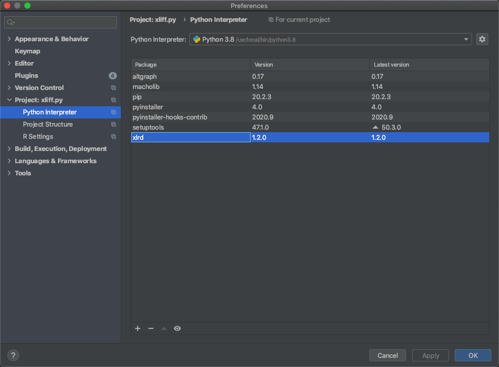
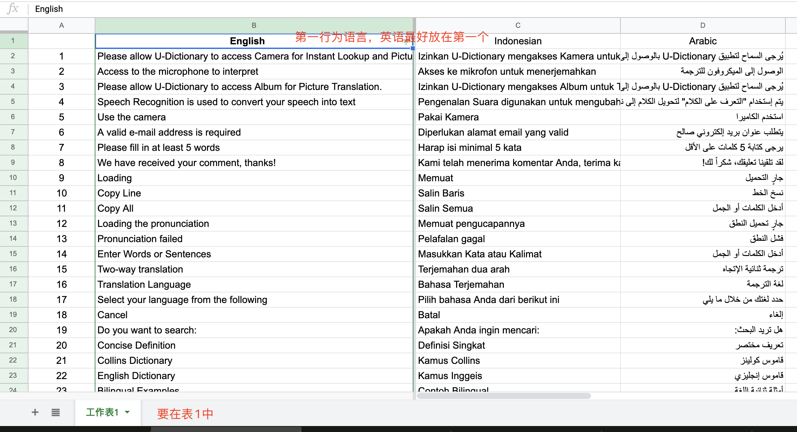

# ExcelToXliff

## 背景
    
国际词典iOS端的海外项目目前有 U-Dictionary 和 One Translate

支持十几种语言的国际化

Apple使用Xliff管理国际化文案，虽然可以直接交付Xliff文件给人工翻译组。

但是考虑到安卓端以及方便管理，目前翻译结果依旧是Excel格式。

而Xliff为XML格式。所以需要进行文案录入。之前方案为人工使用软件XliffTool进行录入

缺点是容易出错以及工作量大。
    
所以用Python3.8写了一个批量录入脚本

## 使用

下载xliff.py文件

替换下面三个参数即可

```

# excel地址
excelPath = r'/Users/cc/Downloads/One所有文案.xlsx'

# xliff地址
xliffPath = r'/Users/cc/Desktop/UDictionary/id.xcloc/Localized Contents/id.xliff'

# 目标语言 需要和excel中一致
targetName = "Indonesian"

# sheetName 从哪个表读取，找不到会默认读取第一个表
sheetName = "sheet1"

```

运行Python需要xlrd库



Excel格式如图



